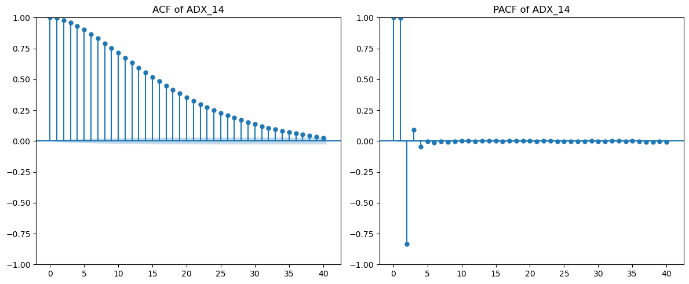
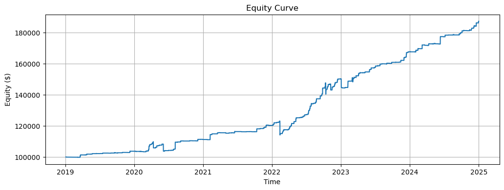
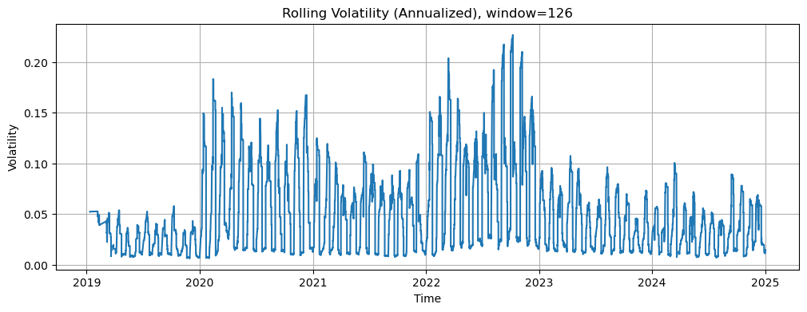

# Forex Quantitative Trading Strategy

**A Machine Learning Approach to Low-Volatility FX Pairs**  
**Author:** Aguru Venkata Saisantosh Patnaik

An end-to-end quantitative research pipeline — from raw hourly FX data to a live-ready XGBoost trading strategy. Achieves **+87% returns** with a **Sharpe ratio of 1.69** and **maximum drawdown of 7.3%** under realistic 0.01% commission, using purged time-series cross-validation to eliminate look-ahead bias.

---

## Table of Contents
- [Key Results](#key-results)
- [Hypothesis & Data](#hypothesis--data)
- [Feature Engineering](#feature-engineering)
- [Model Training](#model-training)
- [Backtesting Results](#backtesting-results)
- [How to Run](#how-to-run)
- [Files](#files)

---

## Key Results

| Metric | Value |
|--------|-------|
| Total Return | **+87%** (with 0.01% commission) |
| Sharpe Ratio | **1.69** |
| Maximum Drawdown | **7.3%** |
| Backtest Period | 2019–2025 (6 years, hourly data) |
| Validation | 5-fold purged time-series CV (no look-ahead) |
| Cross-validation | Randomised search, 30 trials |

---

## Hypothesis & Data

**Hypothesis:** Time-based patterns and macroeconomic factors drive price changes in low-volatility major FX pairs more than raw price momentum alone.

- **Data:** Hourly OHLCV for a low-volatility major FX pair (6 years, 2019–2025)
- **Supplementary data:** U.S. Treasury yield spread (10Y–2Y), daily WTI crude oil, daily gold prices
- **Volume:** Hundreds to low thousands per bar — confirming low-liquidity, low-noise regime

The muted raw volatility made vanilla momentum strategies ineffective — requiring session-aware, macro-augmented feature engineering.

---

## Feature Engineering



### 3 Feature Categories

#### 1. Temporal & Session Features
- **Trading session labels:** Asian-only, European-only, American-only, London+NY overlap
- **Cyclical encoding:** sine/cosine of hour-of-day, day-of-week, month (preserves circular structure)
- **Seasonal indicators:** quarter, month-end, day-of-month flags

#### 2. Macroeconomic Integration
- **US 10Y–2Y Treasury spread** → (10yr − 2yr)/24 scaled to hourly frequency (USD strength proxy)
- **WTI crude oil daily close** → merged to hourly via date join
- **Gold daily close** → merged to hourly; oil trading volume as market activity proxy

#### 3. Technical Indicators (bounded, no lookahead)

| Category | Indicators |
|----------|-----------|
| Trend | ADX (2, 5, 14 periods), CCI (2, 8, 20 periods) |
| Momentum | RSI variants, Chaikin Volume oscillator |
| Volatility | Keltner Channel width (multiple lookbacks), ATR |
| Composite | CCI diff (8−2), Keltner width diff, CCI ratio (2/20), width ratio |

ACF/PACF analysis confirmed serial autocorrelation in key features — validating their predictive relevance.

---

## Model Training

### XGBoost Multi-class Classifier

**Critical design choices:**
1. **Purged Time-Series CV** — 5-fold with 5-bar gap between train and validation to prevent leakage; chronological ordering maintained strictly
2. **Randomised Hyperparameter Search** — 30 trials over learning rate (η), max depth, subsampling, regularisation
3. **Early stopping** — 150 rounds to select optimal iteration
4. **Hindsight-adjusted target** — signal labels corrected for known past mistakes

```python
from xgboost import XGBClassifier
from sklearn.model_selection import TimeSeriesSplit

tscv = TimeSeriesSplit(n_splits=5, gap=5)  # 5-bar gap prevents lookahead
model = XGBClassifier(
    learning_rate=eta,
    max_depth=depth,
    subsample=subsample,
    n_estimators=1000,
    early_stopping_rounds=150
)
```

---

## Backtesting Results



Portfolio grows from $100,000 to ~$187,000 (2019–2025), with a steady upward trajectory. No single catastrophic drawdown event — consistent compounding across all 3 major macro regimes (COVID volatility spike 2020, rate hike cycle 2022–2023, normalisation 2024–2025).



Rolling 126-bar annualised volatility peaked during the 2022–2023 rate hike cycle (~22%) but remained well-managed throughout via the adaptive position framework.

### Performance Breakdown

| Period | Characteristic | Strategy Behaviour |
|--------|---------------|-------------------|
| 2019–2020 | Low volatility, COVID spike | Steady accumulation; navigated March 2020 drawdown |
| 2021–2022 | Rate uncertainty, USD strengthening | Macroeconomic features gave edge on USD pairs |
| 2023–2024 | Normalisation, range markets | Session-based features exploited intraday patterns |
| 2024–2025 | Continued trend | Consistent compounding to $187K |

---

## How to Run

```bash
git clone https://github.com/aguru-venkata-saisantosh-patnaik/Forex-Quantitative-Trading-Strategy-Development.git
cd Forex-Quantitative-Trading-Strategy-Development
pip install -r requirements.txt
```

Open `full_developed_strategy.ipynb` in Jupyter and run all cells. The notebook handles:
1. Data loading (`data.csv`, `gold.csv`, `oil.csv`)
2. Feature engineering (all 3 categories)
3. Target labelling and purged CV split
4. XGBoost training with hyperparameter search
5. Backtesting with commission and equity curve generation

---

## Files

| File | Description |
|------|------------|
| [`full_developed_strategy.ipynb`](full_developed_strategy.ipynb) | Complete pipeline: feature engineering → model → backtest |
| [`data.csv`](data.csv) | Hourly FX OHLCV data |
| [`gold.csv`](gold.csv) | Daily gold prices |
| [`oil.csv`](oil.csv) | Daily WTI crude oil prices |
| [`report.pdf`](report.pdf) | Full research report with methodology and results |
| [`requirements.txt`](requirements.txt) | Python dependencies |

---

## Contact

[agurusantosh@gmail.com](mailto:agurusantosh@gmail.com)
